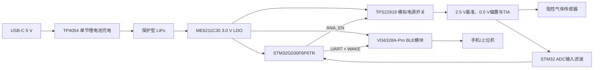

# 01 功能规格

版本：V0.4  
状态：STM32 + 独立 BLE 冻结版

## 1. 产品目标

制作一块由小型锂电池供电的便携式测量板，在阻性气体传感器两端持续施加约 2.000 V，实时测量传感器电流变化，并通过 BLE 上传电流、阻值、实际偏置、电池电压和充电状态。

首版不配置显示屏、蜂鸣器、大容量存储或传感器加热电源。气体浓度必须在取得标准气体标定曲线后换算，未标定前只输出电流和阻值。

## 2. 输入条件与量程

实验曲线中的电流主要约为 0.2–1.6 µA，频率低于数 Hz。TIA反馈电阻降低十倍后，保留约十倍电流余量；低电流端的ADC原始码数会相应减少，因此主量程仍按实验范围验收：

| 参数 | 设计值 |
|---|---:|
| 电气输入范围 | 0–25 µA |
| 主要测量范围 | 0.2–1.6 µA |
| 过量程观察范围 | 1.6–20 µA |
| 软件告警 / 保护关断 | 20 µA / 25 µA |
| 传感器标称偏置 | 2.000 V |
| 主要范围对应阻值 | 约 10 MΩ–1.25 MΩ |
| 电流方向 | 单向 |

```text
Rsensor = Vsensor / Isensor
```

## 3. 系统功能框图



## 4. 功能分配

| 编号 | 功能 | 硬件职责 | STM32职责 | BLE模块职责 |
|---|---|---|---|---|
| F01 | 2 V偏置 | LM4040 + TLV9002产生VCM/VFORCE | 检查实际偏置 | 上传状态 |
| F02 | 电流转电压 | OPA391 + 12 kΩ反馈 | 零点和增益修正 | 无 |
| F03 | 数据采集 | ADC RC网络 | 定时扫描、DMA、平均、软件差分 | 无 |
| F04 | 阻值计算 | 无 | `R = V/I` | 透传结果 |
| F05 | BLE通信 | PCB天线模块 | 组织数据帧和AT控制 | 广播、连接、GATT/透传 |
| F06 | 电池/充电 | TP4054、LDO、分压 | 低电量与充电状态判断 | 上传状态 |
| F07 | 模拟电源管理 | TPS22919 | `ANA_EN`时序控制 | 无 |
| F08 | 调试升级 | SWD测试点 | ST-LINK烧录和调试 | UART AT配置 |
| F09 | 校准 | 精密反馈电阻、测试点 | 保存零点/增益/偏置系数 | 传输校准命令 |

## 5. 核心测量结构

### 5.1 传感器偏置

```text
VCM ≈ 2.5000 V
VFORCE ≈ 0.4984 V
Vsensor = VCM - VFORCE ≈ 2.0016 V
```

固件必须同时采集 VCM 和 VFORCE，不把 2.000 V 当作永远不变的常数。

### 5.2 电流转电压

采用单量程跨阻放大器，不使用四臂惠斯通电桥。

```text
Rf = 12 kΩ，0.1%，低温漂
Cf = 47 nF，C0G
TIA_OUT = VCM + Isensor × Rf
Isensor = (TIA_OUT - VCM) / Rf
```

| 电流 | `TIA_OUT - VCM` | TIA_OUT |
|---:|---:|---:|
| 0.2 µA | 2.4 mV | 2.5024 V |
| 1.6 µA | 19.2 mV | 2.5192 V |
| 16 µA | 192 mV | 2.692 V |
| 20 µA | 240 mV | 2.740 V |
| 25 µA | 300 mV | 2.800 V |

### 5.3 STM32 ADC采集

STM32G030 使用 12 位 ADC 顺序采集：

```text
PA0  AIN_TIA
PA1  AIN_VCM
PA4  AIN_VFORCE
PA5  BAT_SENSE
PA6  VBUS_SENSE
```

固件计算：

```text
Vdiff   = V(AIN_TIA) - V(AIN_VCM)
Vsensor = V(AIN_VCM) - V(AIN_VFORCE)
Isensor = (Vdiff - Vzero) / Rf_cal
Rsensor = Vsensor / Isensor
```

ADC前端约束：

- TIA_OUT、VCM、VFORCE 各串 1 kΩ
- AIN_TIA、AIN_VCM、AIN_VFORCE 各放 10 nF 到GND
- 定时器触发扫描 + DMA；同一帧内连续采集三个模拟量
- 使用较长采样时间、ADC自校准、VREFINT补偿和 64–256 次过采样
- BLE发射会污染微弱模拟量时，错开发射与精密采样或在数据中标记

### 5.4 采样速率

| 模式 | 输出数据率 | 典型用途 |
|---|---:|---|
| 实时 | 20–50 sample/s | 呼吸波形、动态测试 |
| 常规 | 5–20 sample/s | 一般气体变化 |
| 低功耗 | 0.1–2 sample/s | 长时间趋势 |

ADC内部可用更高扫描速率累积平均，默认对外输出 20 sample/s。

## 6. STM32与蓝牙职责边界

STM32负责：

- 模拟电源时序、ADC扫描和校准
- 电流、阻值、电池和故障状态计算
- 数据帧、CRC、序号与时间基准
- 通过 UART 控制/发送给蓝牙模块
- SWD烧录、断点调试和固件升级

VG6328A-Pro负责：

- BLE广播和连接
- 串口透传或AT命令配置
- 通过 PA9 下降沿从低功耗状态唤醒

首版 STM32 不需要外部晶振，使用内部时钟；保留 SWDIO、SWDCLK、RESET_N 和 3V0/GND 测试点。

## 7. 电池与低功耗

- 单节 3.7 V LiPo，充满 4.2 V，建议 200–300 mAh
- USB-C仅用于 5 V充电，不使用USB数据
- TP4054标称充电电流约 100 mA；若使用更小电池，应相应降低
- BAT低于 3.25 V：关闭 `ANA_EN` 并停止精密测量
- BAT低于 3.10 V：STM32进入最低功耗状态，并关闭或休眠蓝牙
- 充电时默认暂停精密测量，但仍可上报充电状态

连续连接时的主要功耗来自独立蓝牙模块，实际续航必须用最终连接间隔、广播周期和采样策略在样机上测量。

## 8. 异常检测

设备至少识别：

- 传感器开路或电流低于有效下限
- 电流超过 20 µA时告警，达到25 µA或TIA/ADC饱和时关断模拟前端
- `VCM - VFORCE` 超出容差
- 模拟电源未稳定
- 电池过低或USB正在充电
- BLE UART拥塞或模块无响应
- 校准参数无效

## 9. PCB与机械目标

- 首版目标不大于 45 mm × 25 mm；优化目标约 35 mm × 25 mm
- STM32、ADC RC和SWD集中在数字/采集区
- BLE模块放在PCB边缘，天线朝外
- 天线下方及前方按模块资料设置全层无铜、无器件、无电池区域
- 传感器接口、TIA反相输入和反馈网络远离 UART、BLE天线、USB和开关边沿
- 关键测试点：BAT、3V0、3VA、VCM、VFORCE、TIA_OUT、GND、SWDIO、SWDCLK、RESET_N、BLE_TX/RX

## 10. 首版明确不做

- 不覆盖 nA 到 mA 六个数量级
- 不使用自动量程、惠斯通电桥或独立高精度ADC
- 不支持带大功率加热器的传感器
- 不保证充电时的高精度测量
- 不在未完成标准气体标定时声称输出准确浓度
