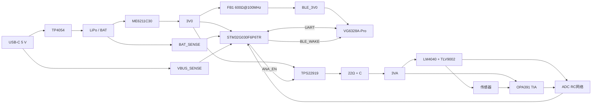

# 02 系统架构与电源树

版本：V0.4  
状态：与 STM32 + 独立 BLE 原理图同步

## 1. 架构结论

整机使用一颗 3.0 V LDO。数字部分由 STM32G030F6P6TR 与 VG6328A-Pro 组成；模拟部分经 TPS22919 独立开关和 22 Ω/电容滤波产生 `3VA`。

```text
LiPo 3.0–4.2 V
 └─ ME6211C30 → 3V0
      ├─ STM32G030F6P6TR
      ├─ FB1 → BLE_3V0 → VG6328A-Pro
      └─ TPS22919 → 3VA_SW → 22 Ω → 3VA
                                      ├─ LM4040 2.5 V基准
                                      ├─ TLV9002 VCM/VFORCE
                                      └─ OPA391 TIA
```

TIA正常输出为 2.500–2.800 V，全部模拟器件可在约 3.0 V 工作，因此不需要 5 V升压。这样减少升压芯片、电感、纹波和面积，并确保模拟故障电压不高于 STM32 ADC 供电轨。

## 2. 主要器件

| 功能 | 首选器件 | 封装/尺寸 | 说明 |
|---|---|---|---|
| 主控与ADC | STM32G030F6P6TR | TSSOP-20 | 32 KB Flash、8 KB RAM、12位ADC、SWD |
| 蓝牙 | VG6328A-Pro | 14.5 × 11.5 mm模块 | 板载天线、UART透传、BLE 5.3 |
| 3.0 V稳压 | ME6211C30M5G | SOT-23-5 | 低成本、主电源常开 |
| 模拟电源开关 | TPS22919DCKR | SC70-6 | 低漏电、受控上电、QOD |
| TIA | OPA391DCKR | SC70-5 | 低失调、低输入偏置电流 |
| 偏置缓冲 | TLV9002IDGKR | VSSOP-8 | 双通道、低成本 |
| 2.5 V基准 | LM4040A25IDBZR | SOT-23 | 0.1%等级 |
| 充电 | TP4054 | SOT-23-5 | 单节LiPo线性充电 |

## 3. 电源与信号总图



## 4. USB、充电和电池检测

- USB-C两个 CC 引脚各使用 5.1 kΩ 下拉
- VBUS进入 TP4054，同时经 1 MΩ/1 MΩ 分压得到 `VBUS_SENSE`
- BAT经 1 MΩ/1 MΩ 分压得到 `BAT_SENSE`
- 4.2 V电池对应ADC输入 2.10 V
- 5.25 V USB对应ADC输入 2.625 V
- 两路高阻分压节点必须配本地电容，ADC使用较长采样时间并丢弃换通道后的首个样本

STM32 ADC参考近似为 `VDDA = 3V0`。VBUS检测最高约 2.625 V，仍低于3.0 V，但接近满量程；固件使用 VREFINT 估算实际 VDDA 后再换算。

TP4054没有独立系统电源路径管理。USB存在时默认暂停高精度测量，避免充电噪声和终止电流判断受系统负载影响。

## 5. 3V0、BLE隔离与去耦

### 5.1 STM32

- U7 VDD/VDDA 连接 3V0，VSS/VSSA连接连续地平面
- C16 4.7 µF（0603）与 C17 100 nF（0402）紧贴主控电源引脚
- VDDA分支优先从安静的3V0节点进入，不让BLE回流穿过ADC地参考
- NRST使用 R21 10 kΩ上拉和 C22 100 nF到地

### 5.2 蓝牙

```text
3V0 → FB1（600 Ω@100 MHz）→ BLE_3V0
BLE_3V0 → C20 4.7 µF || C21 100 nF → GND
```

VG6328A-Pro的工作电源范围覆盖3.0 V。磁珠不是稳压器，只用于限制射频/数字高频电流回灌；若样机发现压降或启动问题，可把FB1改为0 Ω进行A/B对比。

蓝牙模块通过 UART 与 STM32通信，PA9用作下降沿唤醒。模块放在板边，天线区遵守全层禁布。

## 6. 可关断模拟电源

```text
3V0      → U3.IN
ANA_EN   → U3.ON
U3.VOUT  → 3VA_SW
3VA_SW   → 22 Ω → 3VA
3VA      → 1 µF + 100 nF → GND
```

- `ANA_EN`增加 100 kΩ下拉，保证STM32复位期间模拟电源关闭
- TPS22919 QOD经 1 kΩ连接3VA，关断后给模拟电容确定的放电路径
- `3VA`负载约0.30 mA时，22 Ω压降约6.6 mV
- TIA最大正常输出约2.800 V，保留约0.19 V高端余量

## 7. 2.5 V、0.5 V和TIA

```text
3VA → 3.9 kΩ → LM4040A25 → GND
VREF_2V5_RAW ≈ 2.500 V
```

TLV9002-A将基准缓冲成 `VCM`。TLV9002-B把 100 kΩ/24.9 kΩ 分压缓冲成 `VFORCE`：

```text
VFORCE ≈ 2.5 × 24.9 / (100 + 24.9) = 0.4984 V
VCM - VFORCE ≈ 2.0016 V
```

OPA391 TIA：

```text
IN+ = VCM
IN- = SENS_H
RF = 12 kΩ
CF = 47 nF
TIA_OUT = VCM + Isensor × RF
```

反馈极点约282 Hz，远高于数 Hz 的目标信号带宽。样机仍需根据传感器寄生电容检查阶跃响应与稳定性。

## 8. STM32 ADC网络

```text
TIA_OUT → 1 kΩ → PA0 / AIN_TIA
VCM     → 1 kΩ → PA1 / AIN_VCM
VFORCE  → 1 kΩ → PA4 / AIN_VFORCE
BAT_SENSE           → PA5
VBUS_SENSE          → PA6
```

C18、C19、C23均为10 nF，分别从AIN_TIA、AIN_VCM、AIN_VFORCE接到GND。STM32执行单端扫描后软件相减。

12位ADC在3.0 V满量程时：

```text
LSB ≈ 3.0 / 4095 = 0.7326 mV
电流原始分辨率 ≈ 0.7326 mV / 12 kΩ = 61.1 nA/LSB
```

0.2 µA仅对应约3.3个理论差分码，1.6 µA对应约26.2码。降低反馈电阻换取了约十倍过流余量，但低端精度明显下降，必须使用过采样、平均、零点校准和安静的布局，并用样机确认0.2 µA端的有效分辨率。

## 9. 工作时序

启动：

```text
1. 3V0建立，STM32从内部时钟启动
2. 检查VBUS和BAT
3. 初始化UART并检查BLE模块响应
4. ANA_EN置高
5. 等待3VA、基准、VCM和VFORCE稳定
6. 执行ADC自校准并读取VREFINT
7. 检查实际2 V偏置
8. 等待传感器稳定，开始定时扫描
9. 分批通过UART发送给BLE模块
```

停止：

```text
1. 停止ADC触发和DMA
2. ANA_EN置低，释放3VA
3. 通知BLE进入低功耗或断开
4. STM32进入Stop/Standby
```

## 10. 低电量策略

| BAT电压 | 动作 |
|---:|---|
| 高于3.45 V | 正常 |
| 3.25–3.45 V | 上报低电量 |
| 低于3.25 V | `ANA_EN=0`，停止精密测量 |
| 低于3.10 V | BLE休眠/关闭，STM32进入最低功耗状态 |

## 11. 原理图页面

1. `01_Power_Charge`：USB-C、TP4054、电池、LDO、TPS22919和电源检测
2. `02_AFE_TIA`：LM4040、TLV9002、VCM、VFORCE、OPA391、反馈网络和传感器
3. `03_STM32_BLE_Debug`：STM32G030、ADC滤波、VG6328A-Pro、UART、I2C、复位与SWD

## 12. 设计检查

- [x] 主控与BLE分离，降低器件成本和采购风险
- [x] STM32保留SWD烧录、复位和完整ADC通道
- [x] BLE有独立磁珠和本地储能去耦
- [x] TIA正常和故障电压不高于ADC电源轨
- [x] 模拟前端可独立关断
- [x] 2 V偏置具有电源余量
- [x] 原理图改动未增加新的严格DRC告警
- [ ] PCB完成后验证BLE发射对TIA_OUT和VCM的耦合
- [ ] 根据传感器寄生电容确认47 nF反馈电容

## 13. 数据资料

- [STM32G030F6产品页](https://www.st.com/en/microcontrollers-microprocessors/stm32g030f6.html)
- [STM32G030F6数据手册](https://www.st.com/resource/en/datasheet/stm32g030f6.pdf)
- [VG6328A-Pro模块资料](https://atta.szlcsc.com/upload/public/pdf/source/20260701/2E43CC04C6263D77978C2A5830BC3F43.pdf)
- [TPS22919](https://www.ti.com/product/TPS22919)
- [OPA391](https://www.ti.com/product/OPA391)
- [TLV9002](https://www.ti.com/product/TLV9002)
- [LM4040](https://www.ti.com/product/LM4040)
